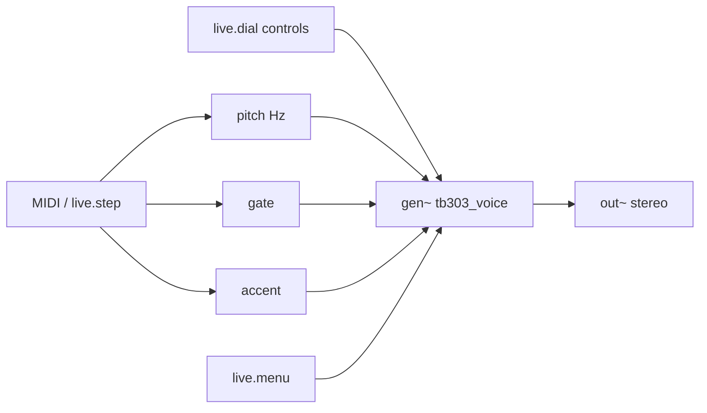

# TB-303 Acid Machine — Max for Live

A Roland TB-303-inspired bass synth for **Ableton Live** built with **Max/MSP** (`gen~`).

## What you get

| Feature | Detail |
|---------|--------|
| Oscillator | Saw or square (303-style asymmetry) |
| Filter | 4-pole diode-ladder-style lowpass with resonance |
| Envelope | Instant attack, decay-only (classic 303) |
| Accent | Louder + brighter on accented steps |
| Slide | Portamento between notes (~55 ms default) |
| Modes | **MIDI** keyboard input or **Sequencer** (16-step `live.step`) |
| Controls | Cutoff, Resonance, Env Mod, Decay, Slide, Drive, Tune, Wave |

## Requirements

- Ableton Live **Suite** (Max for Live included), or Live + Max for Live add-on
- Max **8.6+** (ships with recent Live versions)

## Quick install (5 minutes)

### 1. Add the gen folder to Max search path

In Max: **Options → File Preferences → Add Folder**  
Choose:

```
max-for-live/tb303-acid/gen
```

This lets `gen~ @gen tb303_voice` find `tb303_voice.gendsp`.

### 2. Create the device in Live

1. In Live: **Create → Max for Live → Max Instrument**
2. Click **Edit** to open the Max patcher
3. Select all default objects and delete them
4. **File → Open** → load `patches/tb303-acid.maxpat` from this folder
5. **Save** the device (e.g. `TB303 Acid.amxd`) into your User Library

### 3. Alternative — paste DSP only

If the `.maxpat` needs tweaking on your Max version:

1. Create a blank **Max Instrument**
2. Add: `[in 1]` → `[midiparse]` → `[makenote 100 80]` → `[mtof]` → `[sig~]` (pitch)
3. Gate from `makenote` outlet 2 → `[sig~]` → `gen~` inlet 2
4. Add `[sig~ 0]` → `gen~` inlet 3 (accent), `[live.menu]` → `[sig~]` → inlet 4 (wave)
5. Double-click `gen~`, add a **codebox**, paste contents of `gen/tb303_voice.genexpr`
6. Wire codebox inlets to gen inlets, outlet to gen out
7. `gen~` out → `[dcblock~]` → `[limi~ 1 0.95]` → `[out~ 1]` and `[out~ 2]`

## Playing it

### MIDI mode

1. Set **Mode** to **MIDI**
2. Drop the device on a MIDI track
3. Draw notes in the clip (try C1–C2 range for classic acid)
4. Automate **Cutoff** and **Resonance** while the clip loops

Classic starting point:

- Cutoff ~0.45, Resonance ~0.72, Env Mod ~0.85, Decay ~0.35
- Saw wave, Drive ~1.4

### Sequencer mode

1. Set **Mode** to **Sequencer**
2. Use the **Pattern** (`live.step`) grid — 16 steps synced to Live transport
3. Set **Root** (default MIDI 36 = C2)
4. In the step editor, set per-step **Pitch**, **Accent**, and **Slide** (configure extra columns in `live.step` inspector)

> **Tip:** Right-click `live.step` → **Inspector** → add step parameters: `pitch` (0–24 semitones), `accent` (0/1), `slide` (0/1).

## Signal flow



## TB-303 behavior notes

This is an **inspired-by** emulation, not a circuit-level clone:

- **Slide** is portamento on every pitch change (full slide-per-step wiring is in the step sequencer setup)
- **Accent** boosts amplitude and filter envelope depth
- **Decay** controls both amplitude and filter sweep length
- Filter uses a **nonlinear 4-pole ladder** (`tanh` in the feedback path) for squelchy resonance

For even closer 303 character, try:

- High resonance (0.7–0.9) with moderate cutoff
- Short decay (0.2–0.4) for plucky acid
- Automate cutoff with an LFO or clip envelope

## Files

| File | Purpose |
|------|---------|
| `gen/tb303_voice.genexpr` | GenExpr source (editable in any text editor) |
| `gen/tb303_voice.gendsp` | Compiled gen~ patcher loaded by `gen~ @gen tb303_voice` |
| `patches/tb303-acid.maxpat` | Max for Live instrument shell with UI |

## Troubleshooting

| Problem | Fix |
|---------|-----|
| `gen~` silent / "can't find tb303_voice" | Add `gen/` folder to Max File Preferences |
| No sound in MIDI mode | Check track monitoring, MIDI clip has notes, gate wired to inlet 2 |
| Sequencer not stepping | Live transport must be playing; `live.step` needs `@followglobaltransport 1` |
| Harsh clipping | Lower **Drive** or raise `limi~` threshold |

## License

Synth code in this folder is provided for personal/music use. Roland TB-303 is a trademark of Roland Corporation; this project is not affiliated with or endorsed by Roland.
